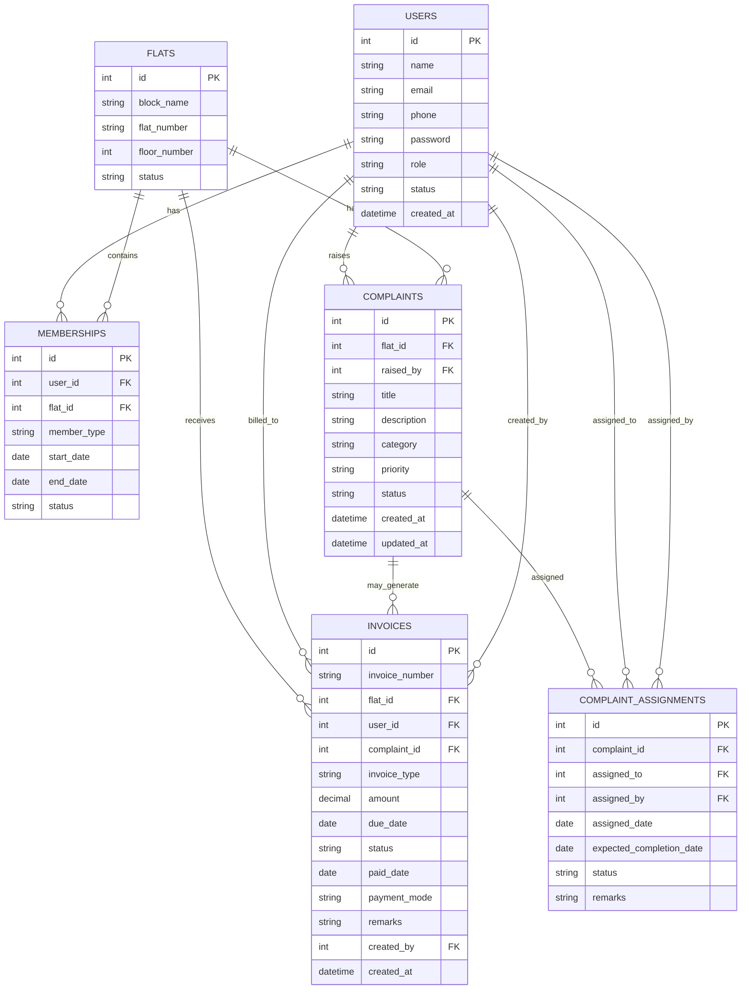

# Database Design Diagram

```mermaid
erDiagram

    USERS {
        int id PK
        string name
        string email
        string phone
        string password
        string role
        string status
        datetime created_at
    }

    FLATS {
        int id PK
        string block_name
        string flat_number
        int floor_number
        string status
    }

    MEMBERSHIPS {
        int id PK
        int user_id FK
        int flat_id FK
        string member_type
        date start_date
        date end_date
        string status
    }

    COMPLAINTS {
        int id PK
        int flat_id FK
        int raised_by FK
        string title
        string description
        string category
        string priority
        string status
        datetime created_at
        datetime updated_at
    }

    COMPLAINT_ASSIGNMENTS {
        int id PK
        int complaint_id FK
        int assigned_to FK
        int assigned_by FK
        date assigned_date
        date expected_completion_date
        string status
        string remarks
    }

    INVOICES {
        int id PK
        string invoice_number
        int flat_id FK
        int user_id FK
        int complaint_id FK
        string invoice_type
        decimal amount
        date due_date
        string status
        date paid_date
        string payment_mode
        string remarks
        int created_by FK
        datetime created_at
    }

    USERS ||--o{ MEMBERSHIPS : has
    FLATS ||--o{ MEMBERSHIPS : contains

    USERS ||--o{ COMPLAINTS : raises
    FLATS ||--o{ COMPLAINTS : has

    COMPLAINTS ||--o{ COMPLAINT_ASSIGNMENTS : assigned
    USERS ||--o{ COMPLAINT_ASSIGNMENTS : assigned_to
    USERS ||--o{ COMPLAINT_ASSIGNMENTS : assigned_by

    FLATS ||--o{ INVOICES : receives
    USERS ||--o{ INVOICES : billed_to
    COMPLAINTS ||--o{ INVOICES : may_generate
    USERS ||--o{ INVOICES : created_by
```
