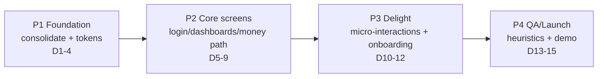

# SocietyEase — Interface Redesign Master Plan
*Synthesis of three expert lenses (UI/UX · Marketing · Management), grounded in the actual `Frontend/src` @ Milestone 2.*
*Detail appendices: `docs/plans/uxux-plan.md`, `docs/plans/marketing-plan.md`, `docs/plans/management-plan.md`.*

---

## 0. The core insight (all three lenses agreed)

**This is a consolidation job, not a paint job.** The repo hides *two* front-end apps in one `Frontend/src/`:

| | App A — ACTIVE (what `npm run dev` shows) | App B — DORMANT but SUPERIOR |
|---|---|---|
| Wired by | `main.js → ./routes.js` | `router/index.js` (imported by nobody) |
| Folder | `components/` (correct spelling) | `componenets/` (**misspelled**) |
| Auth | `utils/auth.js` | `store/auth.js` (reactive role store + guards) |
| Shell | none — flat routes, separate navbars | **`DashboardLayout.vue`** — sidebar + topbar shell |
| Screens | Home, Login, Register, Association*, Tenant* | 3 role dashboards + 10 consistent feature pages + clean Login/Register |
| Data | raw axios per component | `api/index.js` — 12 typed modules matching B 1:1 |

App B is the better architecture — but it is **unmounted, unstyled, and references ~20 CSS classes defined nowhere**, because `style.css` is still the **default Vite scaffold** (purple `#646cff` links, `#1a1a1a` buttons, auto dark-mode, a white-on-white root bug). FontAwesome isn't installed, so **every icon is invisible**.

**The leverage:** define those ~20 classes once in `style.css`, rename `componenets/`→`components/`, and point `main.js` at `router/index.js` — and a coherent 14-screen app appears where today there's a broken scaffold. The structure is already (accidentally) built; it just isn't mounted or styled.

**Canonical decision (locked):** standardize on **App B**; migrate any genuinely unique App A flow; delete App A, `routes.js`, dead `HelloWorld` import, and duplicate Login/Register.

---

## 1. The unifying idea: "Society life, sorted."

One promise binds design, brand, and build: **the quiet confidence of a well-run society office.** Housing-society software in India competes with a chaotic WhatsApp group and an opaque Excel sheet — so the emotional wedge is **trust + calm + effortless**, delivered resident-first (unlike gate-first MyGate or ledger-first ADDA).

Three brand adjectives, each a testable build rule:

| Adjective | Emotional job | Enforced as |
|---|---|---|
| **Calm** | no anxiety | navy + whitespace; dues never scream (amber, not blanket red); reassuring copy |
| **Fair** | trust via transparency | always show the whole picture — Collected *and* Pending, who raised what, anonymized conflicts |
| **Human** | warmth, belonging | sentence case (no `IN_PROGRESS` yelling), warm empty states, celebratory moments |

**Tagline:** *"Society life, sorted."* · **Value prop:** *"Everything your society needs to run itself — calmly."*

---

## 2. The design system (locked tokens)

Palette — formalized from the hexes already inline in App B (`--se-` prefix, CSS variables in `style.css`, layered over Bootstrap 5.3 component vars, no SCSS build needed):

| Token | Hex | Role | Contrast note |
|---|---|---|---|
| **Society Navy** | `#1B2A4A` | primary — sidebar, headings, ₹ figures, primary buttons | 14:1 on white (AAA) |
| **Ease Amber (Marigold)** | `#F2A541` | accent / CTA fill + celebration | **navy text only** (6.8:1); 2.05:1 as text — never text-alone |
| **Community Teal** | `#0E7C7B` | secondary + success ramp (paid/resolved/available) | 5.0:1 (AA) — **kept & promoted** |
| **Danger** | `#dc2626` | genuinely overdue / destructive only | 4.8:1 (AA) |
| **Warn** | `#d97706` | "due soon" / attention | icons/large only; small text `#92400E` on tint |
| Canvas / Surface | `#F7F6F2` / `#FFFFFF` | warm paper bg, white cards | — |

- **Type:** `Anek Latin` (display) + `IBM Plex Sans` (body) — both have Devanagari siblings and tabular ₹ numerals. 4px spacing grid; radius 6/10/14; navy-tinted shadows (border-first, no blur); motion 120–260ms with `prefers-reduced-motion` kill-switch.
- **Component contract:** define all ~20 orphan classes verbatim (`.sidebar`, `.stat-card`, `.badge-custom` + 14 variants, `.card-header-custom`, `.btn-primary-custom`, `.btn-accent`, `.form-control-custom`, `.table-custom`, `.empty-state`, `.modal-*`, `.progress-*`) → all 15 pages restyle with **zero template edits**. One status-pill system serves all four state machines (complaints/invoices/parking/polls), color+text+dot for color-blind safety.

*Anti-goals (rejected): auto dark mode, glassmorphism, gradient headline text, AI cyan-purple, emoji-as-icons, every-button-primary.*

---

## 3. The five signature "fall for it" moves

1. **One next action, always.** Every dashboard leads with a single hero card answering "what do I do now?" — Resident: *"₹2,400 due 20 Jul → Pay now"*; Secretary: *"6 complaints waiting → Triage"*; Worker: *"Flat B-304, leaking tap → Start work"*. Replaces the panic red banner.
2. **Lifecycle rails, never lone status words.** Complaints/invoices render state as a visible `OPEN→ASSIGNED→IN_PROGRESS→COMPLETED→CLOSED` journey with timestamps + actor names — kills the "complaint black hole," the #1 trust killer.
3. **Money gets ceremony.** en-IN tabular ₹ everywhere; payment confirmation is a **receipt artifact** (perforated card, receipt no., teal check-draw, download); bulk invoice generation gets a preview step before committing.
4. **Amber celebration moments.** *"Done! ₹4,500 paid — you're all clear for July 🎉"* on payment; *"3 done today — the building thanks you"* on worker completion; the monthly **Society Health Score** (/100, GREEN badge) as the shareable trophy no competitor has.
5. **Calm, human copy — no `alert()`.** Retire 17+ blocking `alert()`/`confirm()` for brand-voice toasts/modals. *"Please pay before the due date"* → *"₹4,500 maintenance is due Fri — pay in 2 taps whenever you're ready."* Status labels: `IN_PROGRESS` → "In progress" via a label map.

**Differentiators to spotlight:** Society Health Score (the trophy) · Anonymous Neighbor Conflict Resolver (kills WhatsApp drama) · radical money transparency (society-wide Collected vs Pending) · two-tap dues + celebratory receipts · worker-first simplicity.

---

## 4. Phased roadmap (~15 working days to the M2 review; hard exit gates)

- **P1 Foundation (D1–4)** — *the un-glamorous phase that makes everything cheap.* Move `componenets/`→`components/` (router imports become valid with **zero edits**); point `main.js` at `router/index.js`; delete `routes.js` + dead code; write the token layer + ~20 classes in `style.css`; install FontAwesome; kill scaffold artifacts. **Gate:** app boots, all 14 routes render clean, zero Vite artifacts, one reference component fully migrated.
- **P2 Core screens / money path (D5–9)** — Login, Register, 3 dashboards, Complaints, Invoices/Payments, Notices, Members; standardize the shell; convert inline hex → tokens. **Gate:** no inline hex, renders at 360/768/1280px, loading+empty+error states, real or clearly-labeled demo data. **A demoable app exists by Day 9.**
- **P3 Delight (D10–12)** — micro-interactions, skeleton loaders, toasts, the per-persona signature moments, lightweight role-aware onboarding, sweep remaining feature pages. **Gate:** ≥1 delight moment per persona working, motion respects reduced-motion.
- **P4 QA / demo (D13–15)** — cross-role click-throughs, Nielsen heuristic eval, a11y + responsive pass, before/after screenshot deck, rehearse demo script, freeze `main`. **Gate:** heuristic + metric targets met, deck ready, `main` stable.

---

## 5. Effort vs impact — quick wins & cuts

**Quick wins (ship in P1):** tokens + ~20 classes (styles 10+ pages at once) → folder rename + router wiring → delete dead code → Login/Register.

**Never cut:** tokens, consolidation, Login, the 3 dashboards, Complaints, Invoices — that set alone wins the review.

**Cut if short (in order):** dark mode/theme switcher → guided onboarding tour → Equipment/Health/Conflicts pages *if backend is stubbed* (show one polished "planned" frame) → animation libraries (CSS transitions suffice).

---

## 6. Team allocation (mapped to real owners)

| Member | Redesign ownership |
|---|---|
| **Pratik** (Vue frontend) | Design-system implementer — token layer + ~20 classes; Login/Register + 3 dashboards + micro-interactions. Critical path. |
| **Mani Shankar** (frontend+backend) | Consolidation & plumbing — folder merge, router wiring, dead-code deletion, data-layer unification; Complaints + Invoices/Payments. |
| **Nikhilesh** (backend API) | Backend-readiness — audit every endpoint the canonical pages call; provide seed data; expose rail timestamps/actors, receipt numbers, collection totals, resident-safe Collected/Pending. |
| **Praket** (testing/review) | Quality & review gate — component consistency, PR gate (rejects new files in old path), Nielsen heuristics, a11y/responsive QA, reusable Toast/EmptyState/ConfirmModal + voice checklist. |
| **Madhumathi** (coordination) | Program/demo — roadmap + Kanban, DoD tracking, before/after deck, brand-voice guide, metric collection, demo-script narration. |

**P1 parallelism:** Pratik builds tokens ‖ Mani does merge/wiring ‖ Nikhilesh audits endpoints — three independent tracks converging at the P1 gate.

---

## 7. Risks & mitigations

1. **Dual-folder divergence deepens** → make consolidation the *first* task, freeze feature work until the merge PR lands; Praket's PR gate rejects the old path.
2. **Scope creep** → the §5 matrix is the contract; new ideas → Kanban Backlog, not this milestone.
3. **Bootstrap fighting tokens** → theme via CSS vars + `*-custom` classes; keep Bootstrap for grid/layout only; no framework swap.
4. **Backend API gaps** → Nikhilesh's green/red readiness list in P1; red endpoints → single polished "planned" frame, never a mid-fetch-fail.
5. **Deadline crunch** → phase gates guarantee a demoable app by Day 9; P3–P4 are upside; freeze `main` 24h before review.
6. **A11y/contrast** → amber is fill-only with navy label, never body text (folds into Praket's QA).

---

## 8. Success metrics (student-project realistic)

- **5-second first-impression test** (5 peers, redesigned Login + dashboard): target **≥ 4.2/5**.
- **SUS survey** (5–8 classmates): target **≥ 75**.
- **Task-completion** (pay invoice / raise complaint / post notice): 100% success, time down vs baseline.
- **Nielsen 10-heuristic eval:** 0 high-severity, ≤ 3 low.
- **Binary build gates:** 0 Vite artifacts · 0 inline hex in core screens (grep) · 0 `alert(` calls · 100% routes render clean across 5 personas · Lighthouse a11y ≥ 90 · single folder/router/auth store.

---

## 9. Milestone-2 TA demo script (~5 min)

1. **Open (Madhumathi, 30s):** before/after slide (Vite scaffold vs redesigned Login) — "we built a design system," state the 5-sec + SUS headline.
2. **Manager (Pratik, 90s):** Secretary dashboard → stat cards + collection progress → post notice (toast) → assign a complaint.
3. **Resident (Mani, 90s):** dues dashboard → **pay invoice → receipt animation** → raise complaint.
4. **Worker (30s):** assigned tasks → mark done (check-off animation).
5. **Breadth (Nikhilesh, 30s):** Polls, Parking grid, Members — "one shell, role-aware nav, one API layer."
6. **Engineering story (Praket, 30s):** "two divergent apps + a scaffold stylesheet → one folder/router/auth store + a token system," show heuristic score + responsive view.
7. **Close (Madhumathi, 30s):** Kanban, PRs, README; restate before/after.

---

*Thesis: the win is cheap and fast because the structure already exists — mount App B, define the 20 classes it already calls, polish the money path, cut the aspirational pages. A broken Vite scaffold becomes an app people fall for by Day 9, with Days 10–15 as pure upside.*
