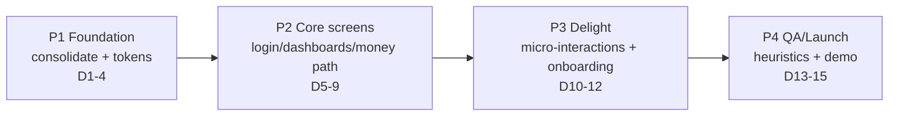

# SocietyEase Redesign — Execution & Management Plan
**Lens:** Engineering/Product Management · **Author:** ManagementLens · **Milestone:** 2 (frontend/backend dev + TA review prep) · **Date:** 2026-07-15

---

## 0. Grounding: the redesign is a *consolidation* job, not a greenfield paint job

Before phasing anything, the single most important managerial fact — established by reading the actual repo, not assumed:

**There are two divergent front-end apps living in one `Frontend/src/`:**

| | **App A — ACTIVE (what the TA sees on `npm run dev`)** | **App B — DORMANT but SUPERIOR** |
|---|---|---|
| Wired by | `main.js` → `import router from './routes'` | `router/index.js` (imported by nobody) |
| Router file | `src/routes.js` | `src/router/index.js` |
| Component folder | `src/components/` (correct spelling) | `src/componenets/` (**misspelled**) |
| Auth | `src/utils/auth.js` (token helpers) | `src/store/auth.js` (reactive role store + clean guards) |
| Shell | none — separate `AssociationNavBar` / `TenantNavbar`, flat routes | **`DashboardLayout.vue`** — unified sidebar + topbar shell |
| Screens | Home, Login (12.4KB), Register (12KB), AssociationManager, Members/Add/Edit, Associationcomplaint/Detail/Add, AssociationInvoice/Detail, Tenant* | 3 role dashboards (Secretary/Resident/Worker) + 10 consistent feature pages (Complaints, Invoices, Expenses, Notices, Polls, Maintenance, Equipment, HealthScore, Conflicts, Parking) + Login (2.6KB)/Register (2.8KB) |
| Data layer | raw axios per component | `src/api/index.js` — 12 typed API modules matching B's pages 1:1 |

**Why this decides the whole plan:** App B (`componenets/`) is the better architecture (one layout shell = one place to inject the design system, role-based guards, 14 routed features, a ready typed API client). Its markup **already references ~20 CSS classes that are not defined anywhere** — `stat-card`, `stat-icon`, `stat-value`, `badge-custom`, `btn-primary-custom`, `form-control-custom`, `progress-bar-custom`, `progress-fill`, `alert-custom`, `card-header-custom`, `table-custom`, `empty-state`, `sidebar*`, `topbar`, `main-content`, `score-circle`, `page-container` — because `src/style.css` is **still the default Vite scaffold** (purple `#646cff` links, `#1a1a1a` buttons, `color-scheme: light dark` auto dark-mode).

**Consequence (the highest-leverage insight in this plan):** *Defining those ~20 classes once in `style.css`, plus renaming `componenets/`→`components/` and wiring `router/index.js` into `main.js`, instantly makes a coherent 14-screen app appear where today there is a broken, unstyled scaffold.* The redesign's biggest win is cheap because the team already (accidentally) built the structure — it just isn't mounted or styled.

**Canonical decision this plan adopts:** Standardize on **App B** (`componenets/` + `router/index.js` + `store/auth.js` + `api/index.js`), migrate the *few genuinely unique* App A screens (rich Login/Register variants, any Tenant-specific flow) into it, then delete App A. Rationale over the reverse: B has the shell, the guards, the feature breadth, and the matching API client; A is flat and role-duplicated.

**Existing implicit palette (harvested from inline styles across B — reuse, don't reinvent):**
- Primary / brand navy `#1B2A4A` · gradient `linear-gradient(135deg,#1B2A4A,#2d4270)`
- Accent / **CTA** amber `#F2A541` (primary call-to-action, logo, highlights)
- Secondary teal `#0E7C7B` (positive / "available" / LOW-risk states)
- Danger `#dc2626` · Warning `#d97706`
- Success text `#065f46` on tint `#d1fae5` · Danger text `#991b1b` on tint `#fee2e2`
- Muted text `#718096` · surface tints `#f0f4f8` / `#f8fafc` / `#f1f5f9`

*(Confirmed with Main 2026-07-15: canonicalize on App B and anchor tokens on this palette — navy `#1B2A4A` = primary, amber `#F2A541` = accent/CTA, teal `#0E7C7B` = secondary, `#dc2626` = danger, `#d97706` = warn. **UXLens formalizes these into the token set and defines the ~20 orphan classes in `style.css`**; this plan schedules and staffs that work.)*

---

## 1. Phased Roadmap (4 phases, ~15 working days / 3 weeks to the M2 review)

Timeline assumes the TA review is ~3 weeks out and the team continues normal M2 backend work in parallel. Each phase has a hard **exit gate** — the next phase does not start until the gate is green.

### Phase 1 — Foundation: consolidation + design system (Days 1–4)
The un-glamorous phase that makes every later phase cheap. **Do NOT skip to pretty screens first.**
- Kill the dual-app divergence: **move App B's files from `componenets/` into the correctly-spelled `components/`** — because `router/index.js` already imports from `../components/`, its imports become valid with **zero router edits** (per UXLens); then point `main.js` at `router/index.js` and delete `routes.js`.
- **Old-app removal (decision — UXLens, `uxux-plan.md` §6 / step 1):** delete all 20 App A files under `components/` (or park in `src/legacy/` for one sprint). App B's `componenets/` `LoginPage`/`RegisterPage` are the canonical bases; App A's login ships non-functional "Sign in with Google/Microsoft" buttons wired only to `alert('…coming soon')` (verified in `components/LoginPage.vue`) — a trust liability for a demo meant to win instant confidence.
- Delete residual dead weight *outside* the App A set: `App.vue`'s dead `HelloWorld.vue` import and `HelloWorld.vue` itself; then grep to confirm no surviving import references any removed file.
- Implement the **design-token layer** in `style.css` from **UXLens's token spec**: `:root` CSS variables (`--se-navy` `#1B2A4A`, `--se-amber` `#F2A541`, `--se-teal` `#0E7C7B`, `--se-danger` `#dc2626`, `--se-warn` `#d97706`, `--se-muted`, `--se-surface`, spacing scale, radius, shadow, font stack) **and** concrete definitions for the ~20 custom classes B already references. Remove `color-scheme: light dark` (kills unwanted dark mode), remove `#646cff`/`#1a1a1a` defaults, remove `body{display:flex;place-items:center}` (breaks full-width layouts).
- Import a real font (Inter/Poppins via CSS) and set FontAwesome once globally.
- **Exit gate:** `npm run dev` boots the canonical app; all 14 child routes render without console errors; zero default-Vite artifacts (purple links, black buttons, auto dark mode) remain; every custom class resolves; one component migrated end-to-end as the reference pattern.

### Phase 2 — Core screens: the money path (Days 5–9)
Refactor the screens a TA and every persona will actually touch, converting inline `style="…"` + hardcoded hex into token classes.
- Login & Register (first impression — must be flawless).
- 3 role dashboards: Secretary (stat cards + collection ring), Resident (dues + my complaints), Worker (assigned tasks).
- Complaints (list + detail + raise/assign), Invoices & Payments (list + pay + receipt), Notices, Members.
- Standardize the `DashboardLayout` shell: sidebar active-state, role-aware nav, topbar page title (already mapped in `titles{}`), responsive collapse.
- **Exit gate:** these screens contain **no inline hex** (tokens only); render cleanly at 360 / 768 / 1280 px; consistent shell/nav/topbar; loading + empty + error states present; real data via `api/index.js` or clearly-labeled demo data.

### Phase 3 — Delight & polish (Days 10–12)
Now, and only now, the "instantly fall for it" layer.
- Micro-interactions: button hover/active states, card hover-lift, 150–200ms transitions, skeleton loaders, animated progress bars/score ring, toast on pay-invoice / raise-complaint / post-notice.
- Signature moments (one per persona): Resident → payment-confirmed receipt animation; Manager → dashboard collection ring fill; Worker → task complete check-off; visitor Parking grid; Society Health-Score circle.
- Lightweight onboarding: first-login welcome banner, demo-account hint on Login (already stubbed: `admin@apt.com / Admin@123`), role-aware friendly empty states ("No complaints — great community!").
- Sweep remaining feature pages (Polls, Parking, Expenses, Maintenance) to token classes; Equipment/Health/Conflicts polished **only if backend data is real** (see §4 risk 4).
- **Exit gate:** every route polished and consistent; ≥1 delight moment per persona demoably working; motion respects `prefers-reduced-motion`.

### Phase 4 — QA / launch / demo prep (Days 13–15)
- Cross-role click-throughs (Manager, Resident, Owner, Worker, Tenant); fix breakages.
- Heuristic evaluation (Nielsen 10) + responsive/browser pass; a11y focus states & contrast.
- Capture **before/after screenshots** (default-Vite baseline vs redesigned) for the deck.
- Rehearse the demo script (§6); update README; Kanban to "Done"; all PRs reviewed & merged to `main`.
- **Exit gate:** heuristic score meets target (§5); demo rehearsed under time; before/after deck ready; `main` is the stable, mergeable, demo-ready branch.

---

## 2. Effort vs Impact Matrix

Impact = does it move "instantly fall for it" + TA-review perception. Effort = eng-days. **QW = Quick Win.**

| Work item | Impact | Effort | Verdict |
|---|---|---|---|
| **Design tokens + define the ~20 custom classes in `style.css`** | ★★★★★ | Low (1–1.5d) | **QW #1** — styles 10+ pages at once because markup already references the classes |
| **Move `componenets/` files into `components/` + point `main.js` at `router/index.js`** | ★★★★★ | Low (0.5d) | **QW #2** — `router/index.js` already imports `../components/`, so the move validates its imports with **zero router edits**; a broken scaffold becomes a working 14-route app |
| **Delete dead code** (HelloWorld import, dup Login/Register, `routes.js`) | ★★★☆☆ | Low (0.5d) | **QW #3** — removes divergence + confusion |
| **Login/Register redesign** | ★★★★★ | Low–Med (1d) | **QW #4** — first impression; small surface, huge perception |
| Role dashboards (Secretary/Resident/Worker) | ★★★★★ | Med (2–3d) | Do — core of the demo |
| Complaints + Invoices/Payments (money path) | ★★★★☆ | Med (2d) | Do — most-used flows |
| Notices + Members | ★★★☆☆ | Low–Med (1d) | Do |
| Micro-interactions (hover/press/toast/skeleton) | ★★★★☆ | Med (1.5d) | Do — the "delight" delta |
| Data-layer unification (App A → `api/index.js`) | ★★★☆☆ | Med (1.5d) | Do in P2 where screens migrate |
| Favicon / page `<title>` / 404 page | ★★☆☆☆ | Low (0.25d) | QW polish |
| Feature pages Polls/Parking/Expenses/Maintenance | ★★★☆☆ | Med (2d) | Do in P3 |
| Onboarding welcome + role-aware empty states | ★★★☆☆ | Low–Med (1d) | Do (lightweight only) |
| Equipment predictor / Health-Score / Conflicts polish | ★★☆☆☆ | Med–High | **CUT if backend stubbed** — aspirational, likely no real data |
| Full guided onboarding tour (coach-marks) | ★★☆☆☆ | High | **CUT** — not review-critical |
| Dark mode / theme switcher | ★☆☆☆☆ | High | **CUT** — remove the auto one; don't build a real one |
| Animation library (GSAP/Framer-style) | ★★☆☆☆ | High | **CUT** — CSS transitions suffice |

**Top quick wins (ship in Phase 1):** design tokens in `style.css` → folder-rename + router wiring → delete dead code → Login/Register.

**What to CUT if time is short (in order):** dark mode & theme switcher → guided onboarding tour → Equipment/Health/Conflicts feature pages (demo them as "planned", show one static polished frame) → advanced animations. **Never cut:** tokens, consolidation, Login, the 3 dashboards, Complaints, Invoices — that set alone wins the review.

---

## 3. Team Allocation (mapped to README responsibilities)

| Member | Stated responsibility | Redesign ownership |
|---|---|---|
| **Pratik Ranjan Bishwal** | Frontend (Vue.js) | **Design-System implementer.** Turns UXLens's token spec into the `style.css` token layer + the ~20 custom classes (Phase 1); owns Login/Register + the 3 role dashboards + micro-interactions. Critical-path frontend role; pairs with UXLens on the token handoff. |
| **Mani Shankar** | DB refinement + Frontend **and** Backend | **Consolidation & plumbing owner.** Executes folder merge, router-into-`main.js` wiring, dead-code deletion, and data-layer unification onto `api/index.js`; owns Complaints + Invoices/Payments screens (frontend + any backend glue). The full-stack bridge. |
| **Nikhilesh** | Initial DB schema + Backend API integration | **Backend-readiness owner.** Verifies every endpoint the canonical pages call actually exists/returns data (auth, members, complaints, invoices, expenses, notices, polls, maintenance, parking); flags gaps early (Risk 4); provides seed/demo data for the review. |
| **Praket Pati Tiwari** | Class/component diagrams, Gantt, **Testing & Reviewing** | **Quality & Review owner.** Owns component-design consistency, PR review gate, Nielsen heuristic evaluation, responsive/a11y QA (Phase 4), test pass, and the component inventory doc. |
| **Madhumathi J** | Coordination, documentation, MoM, Kanban | **Program/Demo owner.** Owns this roadmap + Kanban movement, DoD tracking, before/after screenshot deck, success-metric collection (5-sec test, SUS), README update, and the demo-script rehearsal/narration order. |

**Ownership map:** DS = Pratik · Consolidation/plumbing = Mani · Backend/API = Nikhilesh · Testing/Review = Praket · PM/Demo/Metrics = Madhumathi.
**Parallelism:** During Phase 1, Pratik builds tokens while Mani does the merge/wiring and Nikhilesh audits endpoints — three independent tracks that converge at the Phase-1 gate. Cross-track blockers resolved via the GitHub PR flow (README workflow: branch → PR → PM review → merge).

---

## 4. Top 5 Risks & Mitigations

1. **Dual-folder / dual-app divergence deepens** (`components/` vs `componenets/`, `routes.js` vs `router/index.js`, `utils/auth.js` vs `store/auth.js`). Two people editing "the login page" edit *different files*; work is silently lost.
   - **Mitigation:** Make consolidation the *first* Phase-1 task and freeze feature work until the merge PR lands. Single canonical folder/router/auth store thereafter. Add a short CONTRIBUTING note: "there is exactly one `components/`." Praket's PR gate rejects any new file in the old path.

2. **Scope creep** ("while we're here, add a theme switcher / conflict resolver / animations"). The redesign balloons past the review date.
   - **Mitigation:** The §2 matrix is the contract; the CUT list is pre-agreed. New ideas go to Kanban **Backlog**, not this milestone. Madhumathi guards scope at standup.

3. **Bootstrap fighting custom tokens** (Bootstrap 5 utilities/specificity override the design system; `.btn`, `.card`, form controls revert to default look).
   - **Mitigation:** Keep Bootstrap for **grid + layout utilities only**; theme via CSS variables and the project's own `*-custom` classes (the app already uses `btn-primary-custom`, `form-control-custom`, not raw `.btn`). Where conflict arises, override Bootstrap's own SCSS variables rather than out-specificity wars. **No framework swap** — Bootstrap 5 + CSS variables is sufficient and lower-risk mid-milestone.

4. **Backend API gaps block UI** — `api/index.js` exposes equipment/health/conflicts/parking modules, but the Flask backend may not implement them; pages render empty and look broken in the demo.
   - **Mitigation:** Nikhilesh audits endpoints in Phase 1 and produces a green/red readiness list. Red endpoints → their pages are **CUT to a single polished static frame** labeled "planned," never shown mid-fetch-failure. Provide seed data for all green endpoints so screens look populated at review.

5. **Review-deadline crunch** — polish work compresses; team scrambles the night before.
   - **Mitigation:** Phase gates + the "never cut" core set guarantee a demoable app by end of Phase 2 (Day 9), leaving Phases 3–4 as *upside*, not *dependency*. Freeze `main` 24h before review; only screenshot/README/rehearsal after freeze. Demo script (§6) rehearsed twice.

*(Bonus risk — a11y/contrast: amber `#F2A541` as text on white fails WCAG; since amber is the CTA color, use it as button/icon **fill** with a dark-navy label, never as body text. Fold into Praket's Phase-4 QA.)*

---

## 5. Success Metrics — measuring "people instantly fall for it" (student-project realistic)

**Perception / first impression**
- **5-second first-impression test:** show the redesigned Login + a dashboard to 5 peers for 5s each; rate "looks polished/trustworthy" 1–5. **Target ≥ 4.2 avg.**
- **Before/after screenshot deck:** side-by-side default-Vite baseline vs redesigned, per key screen — the primary visual proof for the TA and the "wow."
- **SUS (System Usability Scale)** quick 10-item survey from 5–8 classmates. **Target ≥ 75 (good).**

**Usability / behavior**
- **Task-completion time & success rate** for 3 canonical tasks — *pay an invoice*, *raise a complaint*, *post a notice* — measured before vs after. **Target: success 100%, time down vs baseline.**
- **Nielsen 10-heuristic evaluation** by Praket: count severity-weighted violations, baseline vs redesigned. **Target: 0 high-severity, ≤ 3 low.**

**Objective build/quality gates (binary, cheap to check)**
- 0 default-Vite artifacts (no `#646cff`/`#1a1a1a`/auto dark mode).
- 0 inline hex in the core-screen set (grep check).
- 100% of routes render without console errors across the 5 personas.
- Lighthouse Accessibility ≥ 90 on Login + one dashboard.
- Single component folder; single router; single auth store.

**TA-review rubric alignment:** production-grade UI demo, visual consistency, responsiveness, clear individual contribution (Kanban + PRs) — all directly served by the phase gates.

---

## 6. Definition of Done & Milestone-2 Demo Script

### Definition of Done — per screen (all must hold)
- Uses **only** design-system tokens/classes — **no inline hex, no hardcoded `style="…"` colors**.
- Renders correctly at 360 / 768 / 1280 px.
- Has **loading + empty + error** states (no raw spinners, no blank fetch-fail).
- Keyboard-accessible: visible focus rings, logical tab order; contrast passes WCAG AA.
- Consistent shell: same `DashboardLayout` sidebar/topbar, correct active nav + page title.
- Real data via `api/index.js` **or** clearly-labeled demo data; **no console errors**.
- Reviewed via PR and merged to `main` (README workflow).

### Definition of Done — release level
Canonical single app on `main`; all "never cut" screens meet per-screen DoD; success-metric targets (§5) met; before/after deck + README updated; Kanban fully reconciled.

### Milestone-2 TA Demo Script (~5 minutes)
1. **Open (Madhumathi, 30s):** Flash the **before/after slide** — default Vite scaffold vs redesigned Login. "We didn't just build features; we built a design system." State the metric headline (5-sec score, SUS).
2. **Manager path (Pratik, 90s):** Log in as `admin@apt.com` → Secretary Dashboard: stat cards, collection ring, recent complaints. Post a Notice → toast confirmation. Open Complaints → assign to a worker.
3. **Resident path (Mani, 90s):** Log in as a resident → dues + my-complaints dashboard → **pay an invoice → payment-confirmed receipt animation** (signature moment) → raise a complaint.
4. **Worker path (Pratik/Mani, 30s):** Log in as worker → assigned tasks → mark one complete (check-off animation).
5. **Breadth flash (Nikhilesh, 30s):** Quick tour of Polls, Parking grid, Members — "one consistent shell, role-aware nav, one API layer."
6. **Engineering story (Praket, 30s):** "We had two divergent apps and a scaffold stylesheet; we consolidated to one folder/router/auth store and a token system." Show heuristic-eval score + responsive view.
7. **Close (Madhumathi, 30s):** Kanban board (task ownership), PR/commit history, README; restate before/after + metrics. End on the redesigned dashboard.

**Rehearsal:** run twice before review; keep under 6 minutes; have seed data loaded and one browser tab pre-authenticated as fallback if live login is slow.

---

### One-line thesis
*The win is cheap and fast because the team already built the structure — mount App B, define the 20 classes it already calls, polish the money path, and cut the aspirational feature pages; that alone turns a broken Vite scaffold into an app people fall for by Day 9, with Days 10–15 as pure upside.*
